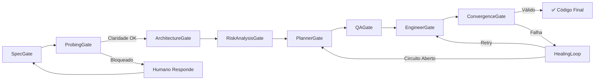

<div align="center">

# ⚡ EMASDEP

**Enterprise Multi-Agent Spec-Driven Engineering Platform**

[](https://python.org)
[](https://fastapi.tiangolo.com)
[](https://react.dev)
[](https://docker.com)
[](LICENSE)

**Transforme intenções de negócio em código funcional com validação multi-agente e auto-cura.**

</div>

---

## 📋 Índice

- [Visão Geral](#-visão-geral)
- [Arquitetura](#-arquitetura)
- [Pipeline de 8 Gates](#-pipeline-de-8-gates)
- [Stack Tecnológica](#-stack-tecnológica)
- [Quick Start](#-quick-start)
- [Configuração de LLM](#-configuração-de-llm)
- [API REST](#-api-rest)
- [Frontend](#-frontend)
- [Testes](#-testes)
- [Estrutura do Projeto](#-estrutura-do-projeto)
- [Contribuição](#-contribuição)
- [Licença](#-licença)

---

## 🎯 Visão Geral

**EMASDEP** é uma plataforma full-stack que automatiza todo o ciclo de vida de engenharia de software a partir de uma **intenção em linguagem natural**. 

O sistema utiliza **múltiplos agentes de IA especializados** (Product Manager, Arquiteto, Planejador, QA, Engenheiro) que colaboram através de um **pipeline em 8 gates** para produzir:

- ✅ **SpecContracts** formais com domínio, interfaces, invariantes e critérios de aceitação
- ✅ **Documentos de Design de Software (SDD)** completos
- ✅ **Análise de riscos e trade-offs** com pontuação e recomendações
- ✅ **Planos de tarefas (TaskDAG)** com dependências e complexidade
- ✅ **Suítes de teste** abrangentes
- ✅ **Artefatos de código** funcionais
- ✅ **Validação multi-camada** (AST, cobertura de código, mutation testing, LLM-as-Judge)

### Características Principais

| Funcionalidade | Descrição |
|---|---|
| **🤖 Multi-agentes** | 6 agentes especializados (PM, Arquiteto, Planejador, QA, Engenheiro, Orquestrador) |
| **🔒 Qualidade por Gates** | 8 gates sequenciais com validação obrigatória entre cada etapa |
| **🩺 Auto-cura** | Motor de healing transacional com classificação de falhas e recuperação adaptativa |
| **🧠 Memória RAG** | Memória episódica, semântica e arquitetural com recuperação por similaridade |
| **📊 Telemetria** | Rastreamento completo de agentes, latência, uso de tokens e métricas de pipeline |
| **🛡️ Guardrails** | 5 regras programáticas: schema, validação, APIs alucinadas, contexto grande |
| **🔌 Múltiplos LLMs** | Suporte a Ollama (local), OpenAI, Google Gemini e provider Mock para desenvolvimento |
| **⚡ Paralelismo** | EngineerGate executa tarefas independentes em paralelo com `asyncio.gather` |
| **🌐 Interface Web** | Frontend React com dashboard, visualização de pipeline, explorador de código e telemetria |

---

## 🏗️ Arquitetura

```
┌──────────────────────────────────────────────────────────────┐
│                     Frontend (React + Vite)                   │
│  Dashboard │ PipelineView │ Settings │ CodeExplorer           │
│  Zustand Store │ API Client │ WebSocket Hooks                 │
└────────────────────────┬─────────────────────────────────────┘
                         │ HTTP / WebSocket
┌────────────────────────▼─────────────────────────────────────┐
│                    Backend (FastAPI + SQLAlchemy)              │
│  REST API | WebSocket /ws/pipeline | SQLite/PostgreSQL        │
└────────────────────────┬─────────────────────────────────────┘
                         │
┌────────────────────────▼─────────────────────────────────────┐
│                   Pipeline Orchestrator                       │
├──────────────┬──────────────┬──────────────┬─────────────────┤
│  StateMachine│    Gates     │    Agents    │   Validation    │
│  (DAG com    │  (8 gates    │  (6 agentes  │  (AST/Coverage/ │
│   rollback)  │   sequenciais│   especializ.│   Mutation)     │
├──────────────┼──────────────┼──────────────┼─────────────────┤
│  Healing     │  Guardrails  │  Memória RAG │   Telemetria    │
│  Engine      │  (5 regras)  │  (episódica/ │   (Tracer +     │
│  (auto-cura) │             │   semântica)  │   Metrics)      │
└──────────────┴──────────────┴──────────────┴─────────────────┘
```

### Principais Componentes

| Módulo | Descrição |
|---|---|
| `orchestrator.py` | Orquestrador principal do pipeline, coordenando a execução dos gates |
| `gates/` | 8 gates de pipeline implementando `PipelineGate` (ABC) |
| `agents/` | Agentes LLM especializados com `LLMAgent` (ABC) |
| `healing/` | Motor de auto-cura com `HealingEngine` e `SnapshotManager` |
| `memory/` | Sistema de memória RAG com `RAGMemory` |
| `validation/` | Validação: AST, cobertura, mutation testing, guardrails |
| `telemetry/` | Rastreamento e métricas: `PipelineTracer`, `MetricsCollector` |
| `core/` | Tipos centrais: `PipelineGateID`, `PipelineState`, `PipelineContext` |
| `api/` | FastAPI REST + WebSocket, rotas, modelos, banco de dados |

---

## 🔄 Pipeline de 8 Gates



| Gate | Agente | Função |
|---|---|---|
| **1. SpecGate** | PMAgent | Transforma intenção em `SpecContract` formal |
| **2. ProbingGate** | LLM (embedded) | Avalia clareza; gera perguntas de esclarecimento |
| **3. ArchitectureGate** | ArchitectAgent | Gera SDD (Software Design Document) |
| **4. RiskAnalysisGate** | LLM (embedded) | Identifica riscos, trade-offs e pontuação geral |
| **5. PlannerGate** | PlannerAgent | Cria TaskDAG com dependências e complexidade |
| **6. QAGate** | QAAgent | Gera suíte de testes abrangente |
| **7. EngineerGate** | EngineerAgent | Escreve artefatos de código (paralelizado) |
| **8. ConvergenceGate** | LLM-as-Judge | Validação final: AST, cobertura, mutation, LLM eval |

---

## 🛠️ Stack Tecnológica

### Backend
- **Python 3.12+** com tipagem estática (`from __future__ import annotations`)
- **FastAPI** — API REST + WebSocket
- **SQLAlchemy 2.0+** — ORM com PostgreSQL (Docker) ou SQLite (local)
- **Click** — CLI para serve/run/version
- **httpx** — Cliente HTTP async para chamadas LLM
- **Rich** — Logging e visualização no terminal
- **Pydantic v2** — Configurações via `pydantic-settings`

### Frontend
- **React 18** + **TypeScript 5** + **Vite 5**
- **React Router v6** — Navegação SPA
- **Zustand** — Gerenciamento de estado
- **React Flow** — Visualização do DAG do pipeline
- **Tailwind CSS 3.4** — Estilização utilitária
- **Lucide React** — Ícones
- **Prism React Renderer** — Destaque de sintaxe

### Infraestrutura
- **Docker Compose** — 4 serviços: PostgreSQL 16, Ollama, Backend, Frontend (nginx)
- **Dockerfile** monolitico também disponível
- **Alembic** — Migrations (opcional)

---

## 🚀 Quick Start

### Pré-requisitos

- **Docker** e **Docker Compose** instalados
- Pelo menos **8GB RAM** livre (recomendado 16GB com Ollama)
- Windows (usar `start_portal.cmd`) ou Linux/Mac (usar `start.sh`)

### Passo 1: Clone e Configure

```bash
git clone <seu-repositorio>
cd portal_sdd

# Configure o ambiente (opcional — o script cria automaticamente)
cp .env.example .env
# Edite .env se necessário (provider LLM, modelo, etc.)
```

### Passo 2: Inicie com Docker

**Windows:**
```cmd
start_portal.cmd
```

**Linux/Mac:**
```bash
chmod +x start.sh
./start.sh
```

### Passo 3: Acesse

- **Frontend**: http://localhost:5173
- **Backend API**: http://localhost:8000
- **Documentação Swagger**: http://localhost:8000/docs
- **Health Check**: http://localhost:8000/api/health

### Modo de Desenvolvimento Local (sem Docker)

**Backend:**
```bash
cd backend
pip install -r requirements.txt
python -m emasdep serve
```

**Frontend:**
```bash
cd frontend
npm install
npm run dev
```

---

## 🤖 Configuração de LLM

O EMASDEP suporta 4 provedores de LLM. Configure via variáveis de ambiente ou pela interface de Settings no frontend.

| Provider | EMASDEP_LLM_PROVIDER | EMASDEP_LLM_BASE_URL | Requer API Key |
|---|---|---|---|
| **Mock** | `mock` | — | Não (modo offline) |
| **Ollama** (local) | `ollama` | `http://127.0.0.1:11434` | Não |
| **OpenAI** | `openai` | `https://api.openai.com/v1` | Sim |
| **Google Gemini** | `gemini` | — | Sim |

### Exemplo `.env`

```env
EMASDEP_LLM_PROVIDER=ollama
EMASDEP_LLM_MODEL=llama3.2:1b
EMASDEP_LLM_BASE_URL=http://127.0.0.1:11434
EMASDEP_LLM_TEMPERATURE=0.0
EMASDEP_LLM_MAX_TOKENS=8192
EMASDEP_DATABASE_URL=sqlite:///.emasdep_portal.db
```

> **Dica**: Para desenvolvimento/testes, use `EMASDEP_LLM_PROVIDER=mock` — nenhum LLM real é necessário.

---

## 📡 API REST

### Endpoints Principais

| Método | Rota | Descrição |
|---|---|---|
| `POST` | `/api/pipeline/start` | Inicia novo pipeline |
| `GET` | `/api/pipeline/status/{id}` | Status completo do pipeline |
| `POST` | `/api/pipeline/answer` | Responde pergunta de sondagem |
| `POST` | `/api/pipeline/cancel/{id}` | Cancela pipeline em execução |
| `GET` | `/api/pipeline/logs/{id}` | Logs do pipeline (com `since`) |
| `GET` | `/api/pipeline/runs` | Lista últimos 50 runs |
| `GET` | `/api/spec/{id}` | SpecContract de um pipeline |
| `PUT` | `/api/spec/{id}` | Atualiza spec |
| `GET` | `/api/config` | Configuração atual do LLM |
| `GET` | `/api/config/ollama-models` | Lista modelos Ollama disponíveis |
| `POST` | `/api/config/test` | Testa conexão com LLM |
| `GET` | `/api/telemetry/stats` | Estatísticas de telemetria |
| `GET` | `/api/pipeline/files/{id}` | Lista artefatos de código |
| `GET` | `/api/pipeline/files/{id}/content` | Conteúdo de um arquivo |
| `GET` | `/api/pipeline/download/{id}` | Download ZIP dos artefatos |
| `GET` | `/api/health` | Health check |
| `WS` | `/ws/pipeline` | Eventos em tempo real |

---

## 🖥️ Frontend

### Páginas

| Página | Rota | Descrição |
|---|---|---|
| **Dashboard** | `/` | Visão geral: cards de estatísticas, editor de spec, runs recentes |
| **PipelineView** | `/pipeline/:id` | Detalhes do pipeline: DAG visual, métricas, logs, artefatos |
| **Settings** | `/settings` | Configuração de LLM: provider, modelo, temperatura, API key |

### Componentes Principais

| Componente | Descrição |
|---|---|
| `SpecEditor` | Editor de intenção em linguagem natural |
| `PipelineDAG` | Visualização interativa dos 8 gates do pipeline |
| `CodeExplorer` | Navegador de arquivos gerados com preview de código |
| `ProbingModal` | Modal interativo para perguntas de esclarecimento |
| `Sidebar` | Navegação com indicador de status do sistema |
| `Header` | Título da plataforma com badge de versão |

---

## 🧪 Testes

```bash
# Testes unitários
cd backend
pytest tests/unit/ -v

# Testes de integração
pytest tests/integration/ -v

# Testes E2E
pytest tests/e2e/ -v

# Todos os testes com cobertura
pytest --cov=src/emasdep tests/ -v

# Mutation testing
mutmut run --paths-to-mutate src/emasdep/
```

### Categorias de Teste

- **Unitários**: AST validator, circuit breaker, config, healing engine, probing gate, skill registry, spec gate, state machine
- **Integração**: API endpoints, orquestração completa do pipeline
- **E2E**: Teste ponta-a-ponta do portal

---

## 📁 Estrutura do Projeto

```
portal_sdd/
├── backend/
│   ├── src/emasdep/
│   │   ├── main.py              # CLI entrypoint (Click)
│   │   ├── orchestrator.py      # PipelineOrchestrator
│   │   ├── config.py            # Configuração pydantic-settings
│   │   ├── agents/              # Agentes LLM especializados
│   │   ├── api/                 # FastAPI REST + WebSocket
│   │   │   ├── routes/          # Rotas da API
│   │   │   ├── models/          # Modelos SQLAlchemy
│   │   │   ├── db/              # Configuração do banco
│   │   │   └── ws/              # WebSocket handler
│   │   ├── core/                # Tipos compartilhados (enums, dataclasses)
│   │   ├── gates/               # 8 gates do pipeline
│   │   ├── healing/             # Motor de auto-cura
│   │   ├── memory/              # Sistema RAG Memory
│   │   ├── skills/              # Registro de skills injetáveis
│   │   ├── telemetry/           # Métricas e tracing
│   │   └── validation/          # AST, cobertura, mutation, guardrails
│   └── tests/
│       ├── unit/
│       ├── integration/
│       └── e2e/
├── frontend/
│   └── src/
│       ├── pages/               # Dashboard, PipelineView, Settings
│       ├── components/          # Componentes React
│       │   ├── pipeline/        # PipelineDAG
│       │   ├── code/            # CodeExplorer, CodePreview, FileTree
│       │   ├── layout/          # Sidebar, Header, Layout
│       │   ├── spec/            # SpecEditor
│       │   └── shared/          # ProbingModal
│       ├── hooks/               # useWebSocket
│       ├── services/            # api.ts (cliente HTTP)
│       ├── store/               # Zustand store
│       └── types/               # Interfaces TypeScript
├── docker-compose.yml           # Infraestrutura completa
├── Dockerfile                   # Container monolítico
├── start_portal.cmd             # Launcher Windows
├── start.sh                     # Launcher Unix
└── skills/                      # Skills injetáveis (.md)
```

---

## 🤝 Contribuição

1. Faça um fork do projeto
2. Crie sua branch de feature (`git checkout -b feature/nova-funcionalidade`)
3. Commit suas mudanças (`git commit -m 'feat: adiciona nova funcionalidade'`)
4. Push para a branch (`git push origin feature/nova-funcionalidade`)
5. Abra um Pull Request

### Convenções de Código

- **Python**: Seguir PEP 8 com line-length 100, docstrings Google-style em Português
- **TypeScript**: Strict mode, interfaces explícitas
- **Commits**: Conventional Commits (`feat:`, `fix:`, `refactor:`, `docs:`, `test:`)
- **Testes**: Todo novo código deve incluir testes unitários

---

## 📄 Licença

Este projeto está sob a licença MIT. Veja o arquivo [LICENSE](LICENSE) para mais detalhes.

---

<div align="center">

**EMASDEP v3.0.0** — Feito com ☕ e 🤖

</div>
